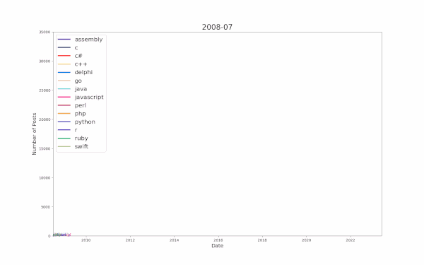
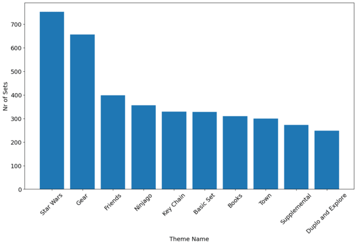
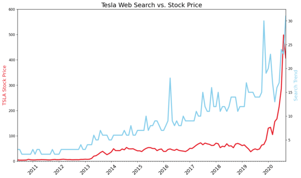
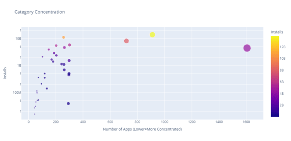
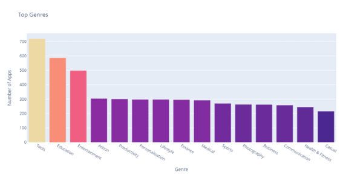
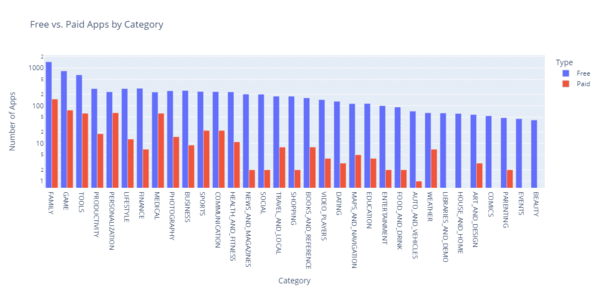
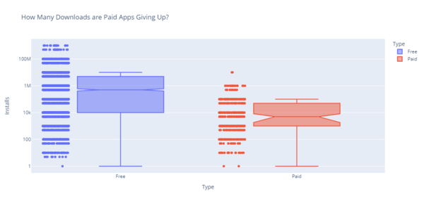

# Data Analytics
Here are my data analytics related works.  
I only update this repo occasionally, for records keeping purposes.  
For more information please check my [Kaggle page](https://www.kaggle.com/angelcc), thanks!  
## Projects
1. Data-exploration-with-pandas: Learn the basic concept and functions of `pandas` module, get used to `.ipynb` notebook enviroment.  
[Try it out](https://colab.research.google.com/drive/1M6zKkEcVuUa2faFtK4MkyPiDTF_oS-PD?usp=sharing)  
  

2. Data-visualization-matplotlib: Performed EDA on dataset using `pandas` then learn the basic functions and methods of `matplotlib` lib, analyze programming language trends using StackExchange query data.  
[Try it out](https://colab.research.google.com/drive/1ZbayOu2tKXJW_W7O__z5ZQ_RV4s1-BNr?usp=sharing)  
  
  

3. Data-aggregate-and-merge-data-with-pandas: Diving deep into a dataset all about LEGO, which will help us answer a whole bunch of interesting questions about the history of the company, their product offering, and which LEGO set rules them all. Keep diving into `pandas` module and learning `agg`, `groupby`, `merge` methods and how to format and beautify MD file with HTML.  
[Try it out](https://colab.research.google.com/drive/1tRpyl94MWhNTMm5ouAW5AQ4o1jqqU4wN?usp=sharing)  
  
  

4. Resampling-and-visualizing-time-series-data: Investigate how search volume for various topics related to their prices or values, through `pandas` and `matplotlib` libraries.  
[Try it out](https://colab.research.google.com/drive/1iN3VAcKX6VeBty6cvGNEzNnANiHa_ORf?usp=sharing)  
  
  

5. Plotly-analyzing-Google-playstore-appdata: Wrestle the Android App Store Data into Beautiful Looking Charts with Plotly.  
[Try it out](https://drive.google.com/file/d/1hJM8nxeap4ejesG7LYB8GfvMQJPCD_um/view?usp=sharing)  
  
  
  
  
  