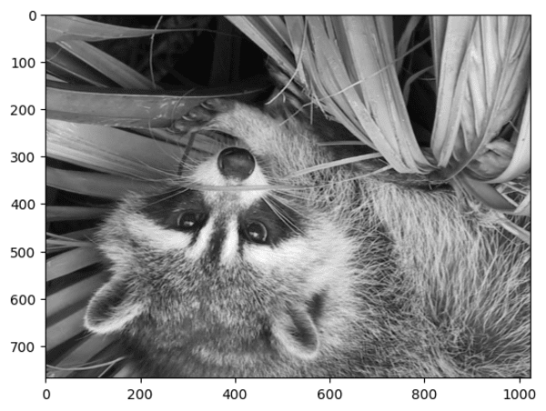
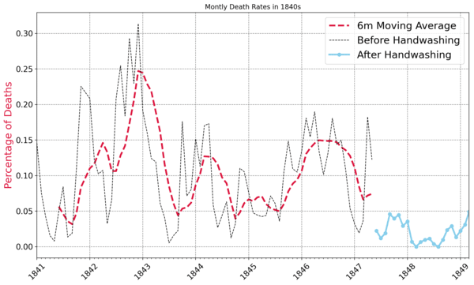

# Data Analytics
Here are my data analytics related works.  
I only update this repo occasionally, for records keeping purposes.  
For more information please check my [Kaggle page](https://www.kaggle.com/angelcc), thanks!  
## Projects
1. **Data-exploration-with-pandas:** Learn the basic concept and functions of `pandas` module, get used to `.ipynb` notebook enviroment.  
[Google Colab](https://colab.research.google.com/drive/1M6zKkEcVuUa2faFtK4MkyPiDTF_oS-PD?usp=sharing)  
  

2. **Data-visualization-matplotlib:** Performed EDA on dataset using `pandas` then learn the basic functions and methods of `matplotlib` lib, analyze programming language trends using StackExchange query data.  
[Google Colab](https://colab.research.google.com/drive/1ZbayOu2tKXJW_W7O__z5ZQ_RV4s1-BNr?usp=sharing)  
  
  

3. **Data-aggregate-and-merge-data-with-pandas:** Diving deep into a dataset all about LEGO, which will help us answer a whole bunch of interesting questions about the history of the company, their product offering, and which LEGO set rules them all. Keep diving into `pandas` module and learning `agg`, `groupby`, `merge` methods and how to format and beautify MD file with HTML.  
[Google Colab](https://colab.research.google.com/drive/1tRpyl94MWhNTMm5ouAW5AQ4o1jqqU4wN?usp=sharing)  
  
  

4. **Resampling-and-visualizing-time-series-data:** Investigate how search volume for various topics related to their prices or values, through `pandas` and `matplotlib` libraries.  
[Google Colab](https://colab.research.google.com/drive/1iN3VAcKX6VeBty6cvGNEzNnANiHa_ORf?usp=sharing)  
  
  

5. **Plotly-analyzing-Google-playstore-appdata:** Wrestle the Android App Store Data into Beautiful Looking Charts with Plotly.  
[Google Colab](https://colab.research.google.com/drive/1Ngxezt33BE1AIbHhQSoXSieSirOHGU0t?usp=sharing)  
  
  
  
  
  

6. **Computation-with-Numpy:** Review basic `numpy` methods and functions, including `arange`, `linspace`, `np.random.random`, image manipulation using array and the concept of `scalar` and `broadcasting`- "NumPy will make the shape of the smaller array - our scalar - compatible with the larger array".  
[Google Colab](https://colab.research.google.com/drive/1JaFKdppfdIZ_uBfiOAuC4uhn8F5NDQRU?usp=sharing)  
 
   
  
  
  

7. **Linear-Regression-with-scikit-learn-and-seaborn:** Dive into movie box office data and explore the relationship between move production budget and its gross income, using linear regression from `scikit-learn` and plot beautiful graphs using `matplotlib` + `seaborn`.  
[Google Colab](https://colab.research.google.com/drive/1eyAri1k7wACnbbty5lbn4nWTBOx6rzVM?usp=sharing)  
  
  

8. **Analyze-Nobel-prize-with-plotly-matplotlib-seaborn:** Analyse a dataset on the past winners of the Nobel Prize using `pandas` and `numpy`, viz with `plotly`, `matplotlib` and `seaborn`.  
[Google Colab](https://colab.research.google.com/drive/1ZulTM0NykyPPL4h5o5y5COpnLP5wtv6L?usp=sharing)  
  
  
  
  
  

9. **Analysis-of-Handwashing-Ttests-and-Distributions:** Analyzing the effect of Dr. Ignaz Semmelweis's implementation of handwashing for Vienna General Hospital in 1840s, using t-tests and distributions.  
[open Google](https://colab.research.google.com/drive/1HQeV68YywJjRc69mvuI6gIr6_ZJpAQgT?usp=sharing)  
  
  
  
  